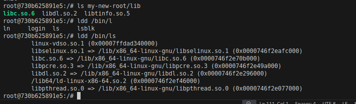

# Command:1                                               


## Use the given code to `create parent docker container`
with cgruop of host computer

```sh
docker run -it --name docker-host --rm --privileged --cgroupns=host ubuntu:bionic
```

without cgroup of the host container

```sh
docker run -it --name docker-host --rm --privileged ubuntu:bionic
```
Let's break down your `docker run` command systematically:

### Breakdown of Parameters:

1. **`docker run`**  
   - This command creates and starts a new container from a specified image.

2. **`-it`**  
   - `-i` (interactive): Keeps the STDIN open even if not attached, allowing interaction.  
   - `-t` (TTY): Allocates a pseudo-TTY (terminal), making it behave like an interactive shell.

3. **`--name docker-host`**  
   - Assigns a name (`docker-host`) to the container instead of a randomly generated one.

4. **`--rm`**  
   - Automatically removes the container once it stops. Useful for temporary containers.

5. **`--privileged`**  
   - Gives the container extended privileges, allowing it to access all host devices.  
   - This is necessary when running system-level commands or working with hardware.

6. **`--cgroupns=host`**
   -  assigns the cgroup of the host to the container
   ## When to Use Each Mode

      | Value   | Use Case |
      |---------|----------|
      | `host`  | When the container needs full access to host cgroups (e.g., managing system resources). |
      | `private` | Default mode, provides isolation, but cgroup operations might fail if cgroups are not mounted. |
      | `none`  | Security-focused environments where cgroups should be completely inaccessible. |


7. **`ubuntu:bionic`**  
   - Specifies the base image (`ubuntu`) and its version (`bionic`, which is Ubuntu 18.04).  

### Why Use This Command?
- It runs an interactive Ubuntu 18.04 container.  
- The container is removed after it stops (`--rm`).  
- It has elevated privileges (`--privileged`), useful for tasks requiring access to host resources.  

----


# Make new root in parent docker container

### perform jailing the process by cretaing and using a new root

1. copy the content of bin/bash to my-new-root/bin
```sh
# make the my-new-root dir
mkdir my-new-root

# create bin dir in my-new-root dir
mkdir my-new-root/bin

# copy the content of bin/bash directory of docker-host to my-new-root/bin
cp bin/bash my-new-root/bin/


```
2. coy the libraries of bin/bash to my-new-root/lib

```sh
# find the libraries in bin/bash
ldd bin/bash

# take the path of each libraries Listed from above command and coppy in my-new-root/lib64 dir
    # linux-vdso.so.1 (0x00007ffc74189000)
    # libtinfo.so.5 => /lib/x86_64-linux-gnu/libtinfo.so.5 (0x00007e71ffcbc000)
    # libdl.so.2 => /lib/x86_64-linux-gnu/libdl.so.2 (0x00007e71ffab8000)
    # libc.so.6 => /lib/x86_64-linux-gnu/libc.so.6 (0x00007e71ff6c7000)
    # /lib64/ld-linux-x86-64.so.2 (0x00007e7200200000)
cp /lib/x86_64-linux-gnu/libtinfo.so.5 /lib/x86_64-linux-gnu/libdl.so.2 /lib/x86_64-linux-gnu/libc.so.6 my-new-root/lib

# copy  /lib64/ld-linux-x86-64.so.2  to my-new-root/lib64 dir

cp /lib64/ld-linux-x86-64.so.2 my-new-root/lib64


```
3. Change the root 

```sh
chroot my-new-root/ bash 

```
your root will change to bash-4.4#

to confirm the current root dir use

```sh
pwd

# it will give output as : /
```

to come out of the current root, use
```sh
exit

# it will take you to the docker-host root i.e.: root@730b625891e5:
```

4. now after comming out of the new-root 
copy bin/ls to my-new-root/bin

```sh
cp /bin/ls my-new-root/bin

```

now copy the libraries of /bin/ls to my-new-root/lib


use
```sh

cp /lib/x86_64-linux-gnu/libselinux.so.1 /lib/x86_64-linux-gnu/libpcre.so.3 /lib/x86_64-linux-gnu/libpthread.so.0 my-new-root/lib
```

Now change root to my-new-root and fire ls command, use

```sh
chroot my-new-root/ bash
```
then 

```sh
ls
```
in case any error like ls not found

exit the current root 

and in docker-host root dir fire these commands

```sh
cp /bin/ls /my-new-root/bin/
cp /bin/bash /my-new-root/bin/
```
and then try to change dir to my-new-dir and fire ls command
---

# OR 
there are more better way of Creating such namespaces in easier way

Use

```sh
# Create the new namespace like container inside the root of the docker-host
# update the libs
apt-get update

# install debootstrap
apt-get install debootstrap -y

# create the new namespace

debootstrap --variant=minbase bionic /better-root

# debootstrap --variant=vairant_name_of_os os_flavour /dir_to_be_crateated_as_new_root

```
now unshare all the nameshapes

```sh
unshare --mount --uts --ipc --net --pid --fork --user --map-root-user chroot /better-root bash
```
now you are in the child root 
then mount the proc, sysfs, and tempfs

```sh
mount -t proc none /proc
mount -t sysfs none /sys #this may require permission
mount -t tempfs none /tmp

```

Now run ps aux command to see what all processes can be seen from inside the child root
```sh
ps aux
```
---

# `cGroups` (Controll Group):

It was the idea of assigning the resources to the `containers` or  unshared namespace environments 

### link to cGroup details page <a href='./cGroup_details.md'>[ click here ... ]</a>

--- 
# step in dockerfile creation
- go to <a href='./step_to_docker.md'> [link..]</a>

---
# <a href='./README.md'>Back to Readme</a>


